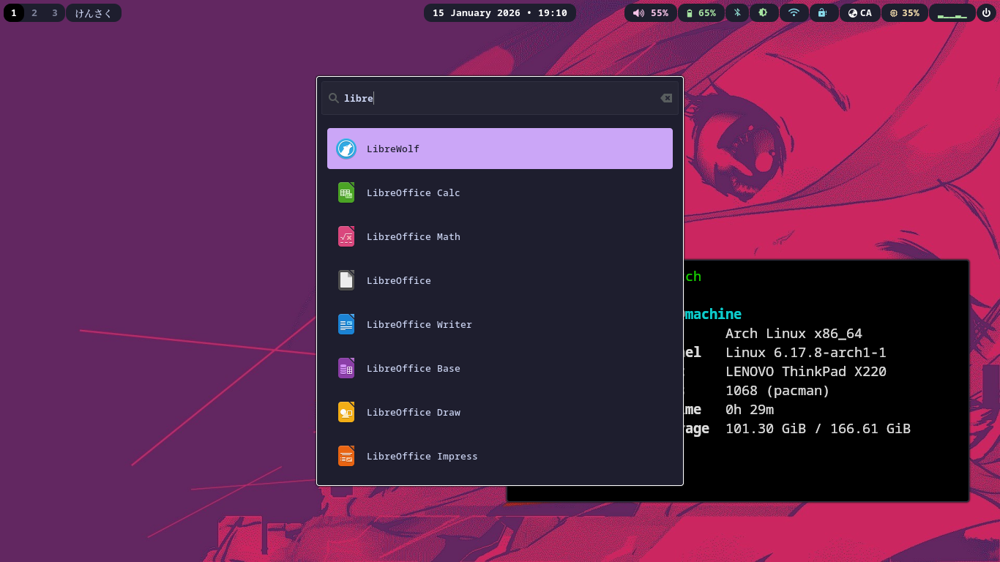

# hyprland-dotfiles
My personal Hyprland/Wayland config. Minimal, functional, and built for daily use on a ThinkPad X220.

## Screenshot

## Setup
1. Clone this repo to `~/.config/`.
2. Install [Hyprland](https://hyprland.org/) and required dependencies.
3. **Add your wallpaper:** Create `~/.config/hypr/general_random/` and place your wallpaper(s) inside.
4. **Install a Nerd Font** for Waybar icons to display properly (e.g., JetBrainsMono Nerd Font).
5. Relogin or restart your session.

## Notes
- **Waybar, Kitty, and Wofi** configs are included.
- **No cache or personal app data** is tracked (see `.gitignore`).
- **External configurations** like VPN, Tor, and similar services are **not included** and must be configured separately by you.
- Configured and tested on a **ThinkPad X220**.

**License:** GPL-3.0. Use, modify, and share freely.
